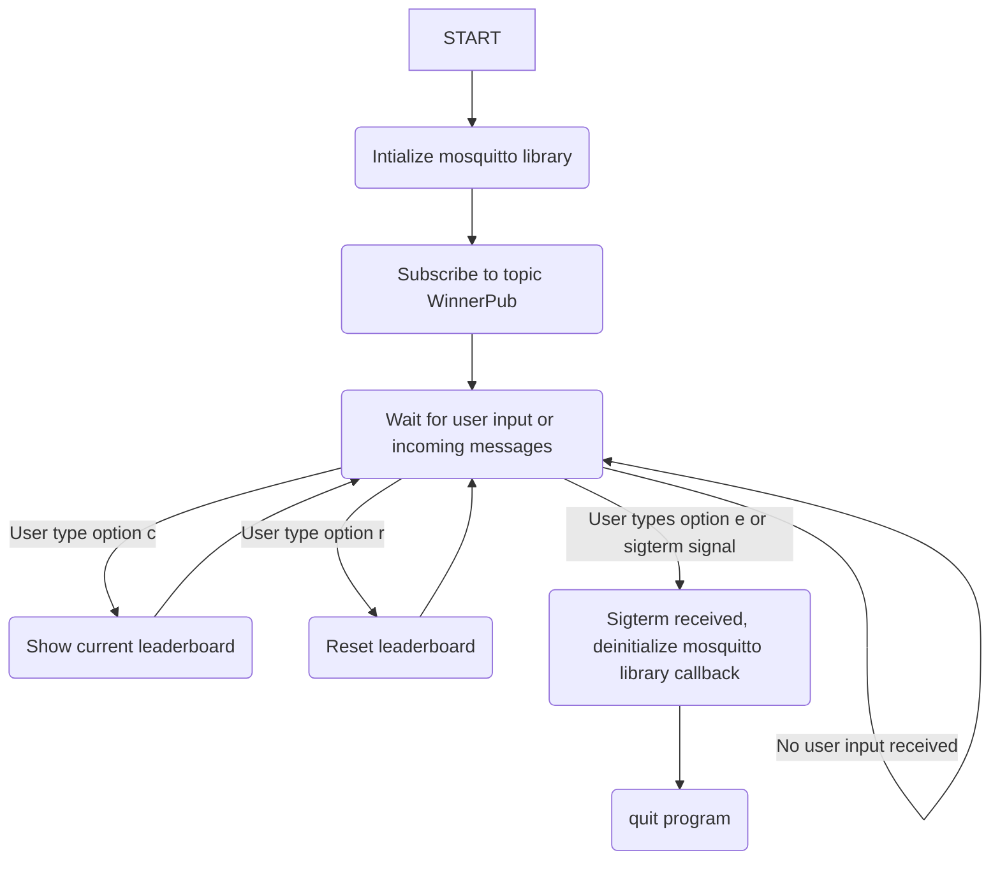
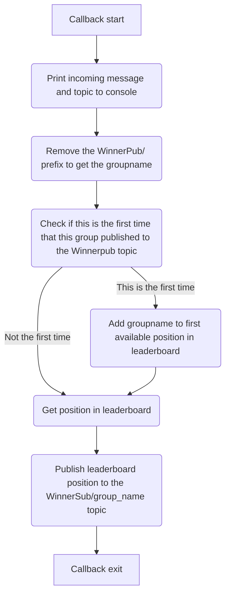

# Winner evaluator

The winner evaluator is an linux/mac application which can be used together with the raspberry pi pico w code. 

## Functionality

The program uses the mosquitto library and connects to a remotely hosted (or locally hosted) MQTT server. Then it subscribes to the topic WinnerPub/  and waits for incoming  messages. When a message gets published to the topic, the application will get the leaderboard position with the topic-name after the WinnerPub prefix. The leaderboard position will then get published  in the corresponding child topic in WinnerSub/ . 


Besides MQTT functionality, the application also waits for commands coming in using the console. 

Commands:

| Command | Short description   | Functionality                                                             |
| ------- | ------------------- | ------------------------------------------------------------------------- |
| c       | current leaderboard | Prints the current leaderboard to the console.                            |
| e       | exit                | Deinitializes dynamically allocated resources and closes the application. |
| r       | reset               | Resets the leaderboard.                                                   |

It works like this:



The program has a callback function for messages received on the subscribed topic:




This program has to be compiled with C++17 as it uses pretty modern standard library functions and classes like: std::find and std::iterator.  CMakeLists.txt already has this preconfigured for you.


## Compiling

Compiling requires you to run two commands:

```bash
cmake . -B build
cd build && make
```

Of course you could also use an IDE like CLion or VS code which will automatically recognize the CMakeLists.txt and do the build process for you.


## Running

Running can be simply done by:

```bash
./award_app
```

Again using an IDE like VS code or CLion is even easier as it has a green launch button (Yes I checked it.. Its green :) ).
